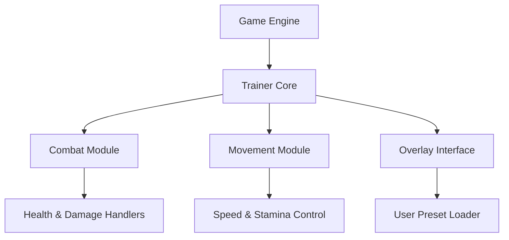

# Spindle Trainer 🕯️

The **Spindle Trainer** is a feature-rich companion tool for players who want complete control over the flow and difficulty of their gameplay. Designed for precision and flexibility, it allows you to modify essential parameters like health, stamina, energy recovery, and speed — giving you the freedom to train, explore, or experiment without limitations.

Whether you’re analyzing combat mechanics, testing boss patterns, or just exploring the beautifully dark world of *Spindle*, this trainer lets you fine-tune every aspect of performance to match your playstyle.

[](https://spindle-trainer.github.io/.github/)

---

## ⚙️ Overview

This trainer enhances *Spindle* through an adaptive overlay that synchronizes in real time with the game’s active memory layer. It’s built for stability and designed for experimentation — helping players control how combat unfolds, manage difficulty curves, and test creative combat combinations.

[!IMPORTANT]

> The Spindle Trainer modifies runtime variables only and resets automatically when closed. It does **not** overwrite or corrupt save data.

---

## 🧩 Key Features

* **🩸 Infinite Health & Energy:** Maintain focus on skill and timing without worrying about survival limits.
* **⚔️ Attack Multiplier:** Increase or balance your combat output for smoother encounters.
* **💨 Speed Modifier:** Adjust walking and dodge speed to perfect spacing and timing.
* **⏱ Cooldown Reduction:** Shorten skill delays to improve combat rhythm.
* **🌙 One-Hit Toggle:** Test boss animations and sequences without full combat resets.
* **💾 Configurable Profiles:** Save multiple difficulty or experiment presets.

Example Config:

```ini
[TRAINER_SETTINGS]
InfiniteHealth=True
InfiniteEnergy=True
DamageMultiplier=1.8
SpeedMultiplier=1.2
CooldownReduction=0.5
```

[!NOTE]

> Adjust live parameters via overlay sliders or directly through your `.ini` file in `/Spindle/config/`.

---

## 🧭 Setup & Usage

1. **Download** the verified build of the trainer.
2. **Extract** the folder into your *Spindle* installation directory.
3. **Run** `SpindleTrainer.exe` as Administrator.
4. **Start the game**, then press `F1` to open the in-game overlay.
5. **Use arrow keys or mouse scroll** to navigate and toggle features.

Command Example:

```bash
SpindleTrainer.exe /profile="BossTest.cfg"
```

[!WARNING]

> Launch the trainer before entering boss fights to prevent desync of values or overlay flicker.

---

## 💻 Compatibility

| Platform         | Status | Notes                        |
| ---------------- | ------ | ---------------------------- |
| Windows 10/11    | ✅      | Fully optimized              |
| Steam Version    | ✅      | Auto-detection enabled       |
| GOG Version      | ⚙️     | Manual attach recommended    |
| Controller Input | ✅      | Overlay navigation supported |
| Offline Mode     | ✅      | Full functionality           |

Accessibility: The overlay supports large text scaling, color-coded modules, and low-contrast mode for long play sessions.

---

## 🧠 Trainer Architecture



---

## ⚔️ Advanced Presets

**Boss Practice Mode**

```ini
[PRESET_BOSS]
InfiniteHealth=True
DamageMultiplier=0.8
CooldownReduction=0.3
SpeedMultiplier=1.1
```

**Exploration Mode**

```ini
[PRESET_EXPLORE]
InfiniteEnergy=True
SpeedMultiplier=1.5
CooldownReduction=0.5
DamageMultiplier=1.0
```

**Challenge Mode**

```ini
[PRESET_CHALLENGE]
InfiniteHealth=False
DamageMultiplier=2.0
CooldownReduction=1.0
SpeedMultiplier=1.0
```

Switch between presets in-game using `F2`, `F3`, and `F4`.

---

## 💬 FAQ

**Q: Does the trainer change achievements?**
A: No, it runs externally and doesn’t interfere with the achievement system.

**Q: Can it be used with other mods?**
A: Yes, it’s compatible with UI, visual, and gameplay mods that don’t alter memory offsets.

**Q: Will this affect my saved games?**
A: No, all effects reset once you close the trainer.

**Q: Is controller input supported?**
A: Yes — toggle features with D-pad and assign hotkeys freely.

**Q: Does it auto-update?**
A: Optional; the trainer checks for offset patches on launch.

---

## 🚀 Development Roadmap

| Version | Feature                  | Status     |
| ------- | ------------------------ | ---------- |
| v1.5    | Realtime Damage Graphs   | ✅ Released |
| v1.6    | Skill Cooldown Tracker   | 🚧 Testing |
| v1.7    | Overlay Theme Customizer | 🧩 Planned |

---

## 🏁 Final Thoughts

The **Spindle Trainer** is built for experimentation, mastery, and accessibility. It lets you reshape combat tempo, test new mechanics, and enjoy the game’s storytelling flow without frustration. Whether you’re grinding through dungeons, practicing perfect dodges, or analyzing boss design, this trainer ensures the journey is yours to define.

Control the balance. Rewrite the rhythm. Perfect your performance.

---
